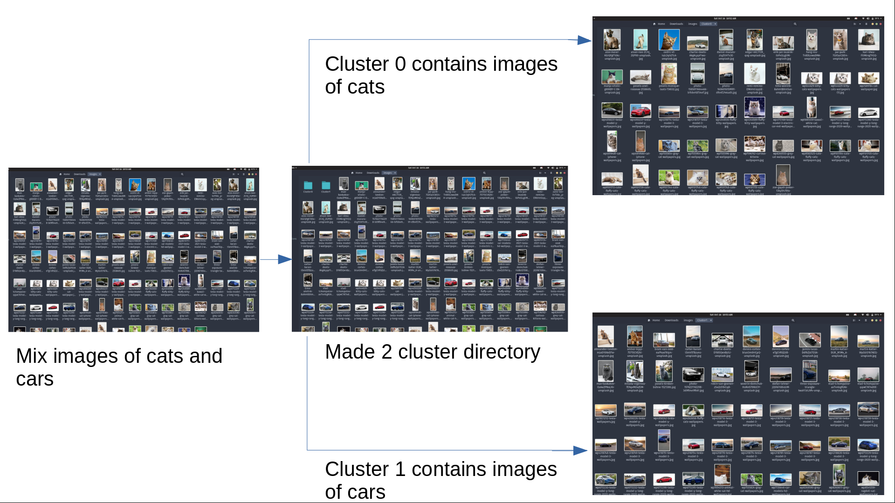

# IMAGE_GROUPING

Segregates images using feature extraction and Clustering algorithm

## Table of Contents

- [About the Project](#about-the-project)
    - [Aim](#aim)
    - [Description](#description)
    - [Tech Stack](#tech-stack)
    - [File Structure](#file-structure)
- [Getting Started](#getting-started)
    - [Prerequisites](#prerequisites)
    - [Installation](#installation)
- [Usage](#usage)
- [Results and Demo](#results-and-demo)
- [Future Work](#to-dos)
- [Troubleshooting](#troubleshooting)
- [Contributors](#contributors)
- [Acknowledgements and Resources](#acknowledgements-and-resources)
- [License](#license)

## About The Project

## Aim

This project aims at creating an image grouping algorithm. The algorithm should be able to group similar images on the basis of extracted features.

## Description

We have used ORB algorithm for extracting features and Scikit K-means clustering algorithm to clusterize images. So it reads images from a folder and applies ORB to all images to give its descriptors and finds optimum no. of groups(K) then applies K-means on descriptors and paste images to their respective cluster folder. For more info refer our [report](report/report.pdf)



## Tech Stack

- [OpenCV](https://opencv.org/)
- [Scikit Learn](https://scikit-learn.org/stable/)

## Getting Started

### Prerequisites

- Should have python environment. You can refer [here](https://www.tutorialspoint.com/python/python_environment.htm) for the setup.
- Python librairies
    - [OpenCV](https://pypi.org/project/opencv-python/) `pip install opencv-python`
    - [Scikit](https://scikit-learn.org/stable/install.html) `pip install scikit-learn`
    - [numpy](https://numpy.org/install/) `pip install numpy`
    - [kneed](https://pypi.org/project/kneed/) `pip install kneed`

For installation of pip you can refer [here](https://www.geeksforgeeks.org/how-to-install-pip-on-windows/)

- Must have Test Data, or you can get it from [here](https://drive.google.com/file/d/1wu7fiQ0NtBH5s2wu4JrZEnFjwblHCOlX/view?usp=sharing) and from [kaggle](https://www.kaggle.com/datasets).

### Installation

1.  Clone the repo
    
    ```git
    git clone https://github.com/shahpratham/Image_Grouping.git
    ```
    

### Usage

```bash
cd /path/to/Image_Grouping
```

> For using Sklearn K-means use this, similar can be done openCV code

```python
python kmeansUsingSkLearn.py
```

> For viewing Cluster Directory

```
cd /path/to/TestDAta
```

## Results and Demo

|     |     |
| --- | --- |
| **Task** | **Time Taken (in seconds)** |
| Pre-processing | 5.941 |
| Feature Extraction | 48.796 |
| Finding no. of clusters (Optimum k) | 19.147 |
| Clustering | 0.874 |
| Creating Directories and pasting images | 0.757 |

> Did this for 101 images and tested on Lenovo Legion 5(Ryzen 5 4600H) and got accuracy close to 80%.

https://user-images.githubusercontent.com/82367556/138553107-c3c90182-79d6-4d36-b1d3-16a27a6b8b86.mp4


## Future work

- [x] Finding optimum of K
- [ ] Improving accuracy
- [ ] Make a web app where one can upload images and can cluster it online.

## Troubleshooting

- Changing parameters like `nfeatures`,  `edgeThreshold`and `fastThreshold` in `ORB_create` can prove to be effective for some datasets
- The ideal way for dealing with outliers was to increase your test data
- After changing max cluster value from 10 to 20, `KneeLocator` was able to find optimum value

## Contributors

- [Pratham Shah](https://github.com/shahpratham)
- [Yash Deshpande](https://github.com/yashLM705)

## Acknowledgements and Resources

- [SRA VJTI](https://github.com/SRA-VJTI) Eklavya 2021
- Our mentors [Mann Doshi](https://github.com/MannDoshi) and [Prathamesh Tagore](https://github.com/meshtag) for their guidance throughout this project
- [K-means Research Paper](https://ieeexplore.ieee.org/document/5453745)
- [ORB Research Paper](https://ieeexplore.ieee.org/document/6126544?denied=)
- [Optimum K](https://www.geeksforgeeks.org/elbow-method-for-optimal-value-of-k-in-kmeans/)
- For more resources refer References section in [report](report/report.pdf)

## License

The [License](LICENSE) used in this project
