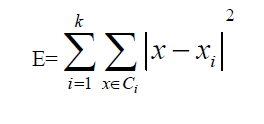

# Image_Grouping

### What are Features?

A feature is a piece of information about the content of an image; typically about whether a certain region of the image has certain properties. Features may be specific structures in the image such as points, edges or objects.

### Types of Features

- **Edges**: Edges are points where there is a boundary between two image regions. Edges are usually defined as sets of points in the image which have a strong gradient magnitude.

- **Corners / interest points**- It refer to point-like features in an image, which have a local two dimensional structure. It was then noticed that the so-called corners were also being detected on parts of the image which were not corners in the traditional sense (for instance a small bright spot on a dark background may be detected). These points are frequently known as interest points

- **Blobs / regions of interest points**: Blobs provide a complementary description of image structures in terms of regions, as opposed to corners that are more point-like. Blob detectors can detect areas in an image which are too smooth to be detected by a corner detector.

- **Ridges**: Ridges are formed with the points where the intensity gray level reaches a local extremum in a given direction. A ridge can be thought of as a one-dimensional curve that represents an axis of symmetry, and in addition has an attribute of local ridge width associated with each ridge point. Ridge descriptors are frequently used for road extraction in aerial images and for extracting blood vessels in medical images

### What is K-means Clustering Algorithm

K-means clustering is a method of vector quantization, originally from signal processing, that aims to partition n observations into k clusters in which each observation belongs to the cluster with the nearest mean. It is a numerical, unsupervised, non-deterministic, iterative method. It has to calculate the distance between each data object and all cluster centers in each iteration, which makes the efficiency of clustering is not high.

The algorithm consists of two separate phases. The first phase selects k centers randomly, where the value k is fixed in advance. The next phase is to take each data object to the nearest center. Euclidean distance is generally considered to determine the distance between each data object and the cluster centers. When all the data objects are included in some clusters, the first step is completed and an early grouping is done. Recalculating the average of the early formed clusters. This iterative process continues repeatedly until the criterion function becomes the minimum.

E is the sum of the squared error of all objects in the database. The distance of criterion function is Euclidean distance, which is used for determining the nearest distance between each data object and cluster center.
So, the process of the k-means algorithm is :- 
Input: Number of desired clusters, k, and a database D={d1, d2,…dn} containing n data objects.
Output: A set of k clusters Therefore the computational time complexity of the k-means algorithm is O(nkt),where n is the number of all data objects, k is the number of clusters, t is the iterations of the algorithm and the positive integer t is known as the number of k-means iterations. The precise value of t varies depending on the initial starting cluster centers, usually requiring k << n and t << n.

### The shortcomings of K-means Clustering Algorithm

We can see from the above analysis of algorithms, the algorithm has to calculate the distance from each data object to every cluster center in each iteration. However, by experiments we find that it is not necessary for us to calculate that distance each time.

### Improved K-means Clustering Algorithm

The main idea of algorithm is to set two simple data structures to retain the labels of cluster and the distance of all the date objects to the nearest cluster during the each iteration, that can be used in next iteration, we calculate the distance between the current date object and the new cluster center, if the computed distance is smaller than or equal to the distance to the old center, the data object stays in it’s cluster that was assigned to in previous iteration. Therefore, there is no need to calculate the distance from this data object to the other k- clustering centers, saving the calculative time to the k-1 cluster Centers. And then we separately record the label of the nearest cluster center and the distance to it’s center. Because in each iteration some data points still remain in the original cluster, it means that some parts of the data points will not be calculated, saving a total time of calculating the distance, thereby enhancing the efficiency of the algorithm.
The process of the improved algorithm is described as follows:
Input: The number of desired clusters k, and a database D={d1, d2,…dn} containing n data objects.
Output: A set of k clusters

The information in data structure allows this function to reduce the number of distance calculations required to assign each data object to the nearest cluster, and this method makes the improved k-means algorithm faster than the standard k-means algorithm time complexity of the improved k-means algorithm is O(nk). While the standard k-means clustering algorithm requires O(nkt). So the proposed k-means algorithm in this paper can effectively improve the speed of clustering and reduce the computational complexity. But the improved k-means algorithm requires the pre-estimated number of clusters, k, which is the same as the standard k-means algorithm. If you want to get to the optimal solution, you must test the different values of k.

### Conclusion

The computational complexity of the standard k-means algorithm is objectionably high owing to the need to reassign the data points a number of times during every iteration, which makes the efficiency of standard k-means clustering is not high, without sacrificing the accuracy of clusters.

